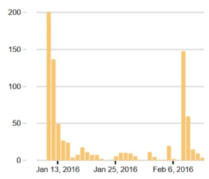
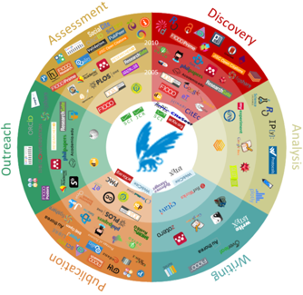

# VU 101 Analysis
This repository collects all files to compile the report for the analysis of the 101 Innovations for VU University Amsterdam.

Main input file is `Report-vu101.Rmd`, output is `Report-vu101.html`.

De UBVU wil haar dienstverlening graag zo dicht mogelijk aansluiten bij het wetenschappelijke communicatieproces van de onderzoekers van VU en VUmc.

Het wetenschappelijke communicatieproces is volop in beweging. Dit komt door de inzet van digitale middelen binnen de onderzoeksfases: Discovery, Analysis, Writing, Publication, Outreach en Assessment.

Het project doet onderzoek naar naar wat het gebruik is van deze digitale middelen binnen het VU en VUmc, en sluit hierbij aan bij een internationaal onderzoek waardoor resultaten vergeleken kunnen worden met andere landen.

De onderstaande resultaten zijn bedoeld als gespreksstof met de faculteiten om de dienstverlening te verbeteren, vernieuwen en te veranderen, zodat ze beter aansluit bij de fases van de onderzoekspraktijk van de onderzoekers.

# Aanpak
Er zijn [onderzoeksvragen](https://docs.google.com/document/d/1p3k5PLXtJNvGviWvsBoPZ4dbgGU9Fa_dHb08iOdvC6Q/edit?usp=sharing) door de vak- en thema specialisten opgesteld. Dit zijn de vragen die nodig zijn om het gesprek te voeren. Voor elke vraag is een raamwerk gemaakt waarbinnen het antwoord vanuit de enquete resultaten kan worden gegeven. Vanuit het oogpunt tijd, is gekozen om alleen de vragen te beantwoorden met de hoogste urgentie.

De vragen moeten antwoord geven voor twee vraag-categoriën:
1. Het toolgebruik binnen de VU in haar geheel
2. Het toolgebruik binnen Disciplines

Met name de laatste vraag-categorie is interessant voor vak- en themaspecialisten, waar ze inzicht krijgen in het tool-gebruik binnen de discipline die ze vertegenwoordigen.

# Data gathering
Met deze enquete hebben we meegelift bij een bestaand onderzoek van Kramer, B. and J. Bosman, *Innovations in scholarly communication - global survey on research tool usage* [version 1; referees: awaiting peer review]. F1000Research 2016, 5:692
[(doi: 10.12688/f1000research.8414.1)](http://dx.doi.org/10.12688/f1000research.8414.1)

We hebben een custom URL aangevraagd waardoor VU en VUmc onderzoekers in de binnengekomen data is te onderscheiden met de hash 7V4u8a. Van deze custom URL is een verkorte URL gemaakt [http://bit.ly/vu101innovations], zodat we de activiteit van de verspreiding makkelijker bij konden houden. We hebben aan de portefeuillehoudersonderzoek gevraagd deze verkorte URL door te sturen naar hun onderzoekers.

In twee e-mail acties leverde het in januari een activiteit op van 543 bezoekers, en in februari 296 bezoekers, in totaal 839 bezoekers.

De VU en VUmc hebben bijelkaar ongeveer 6000 personen wetenschappelijke staf.

# Resultaten
De vraag-categorien komen ook terug in de nummering van de resultaten.

Elke vraag bevat een antwoord, aangevuld met diagrammen. Een vraag begint met een samenvattende uitleg en diagram en daarna volgen de sub-secties met gedetailleerdere diagrammen.

De Scholarly Communication Fases zullen gedurende het hele rapport terug komen: Discovery, Analysis, Writing, Publication, Outreach en Assessment.

